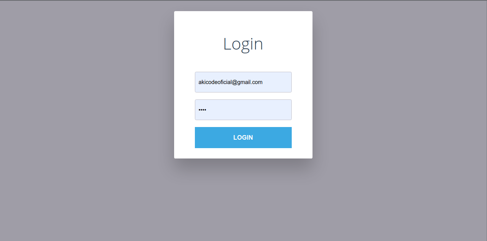

# App Full Stack

Criando uma aplicação web full stack usando react.js e nodejs puro no lado do servidor.

## Como Iniciar o Servidor

```bash
npm install --prefix backend
npm run start --prefix backend
```

## Como Iniciar o Site

```bash
npm install --prefix frontend
npm run build --prefix frontend
npm run start --prefix frontend
```

### Credenciais

email: **akicodeoficial@gmail.com**
senha: **root**


